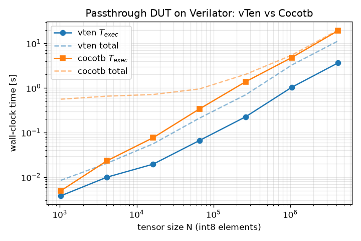

# Case study: vTen vs. hand-written Cocotb (paper methodology reproduction)

This benchmark reproduces the **evaluation methodology** of the vTen paper
(DAC'26, §4) with fully open assets: the same tensor transfer is verified on
the **same DUT** and the **same simulator** twice — once through vTen's
SV-DPI shared-memory transport, once through an idiomatic, hand-written
[Cocotb](https://www.cocotb.org/) testbench — and the wall-clock cost is
decomposed into the paper's per-stage latency model
(T_ser + T_load + T_exec + T_ver, §3.4.3).

## ⚠️ Honest framing — what this is and is not

- The paper's DUT is a **lab-internal 3D U-Net NPU** (1,802 DSPs, AXI4-Stream
  / AXI4-Lite / AXI4, synthesized for an Alveo U280). It is **not public**,
  so this case study **does not reproduce the paper's exact numbers**.
- Instead, it demonstrates the **same measurement methodology** on the
  repository's open `passthrough` DUT (a combinational AXI4-Stream copy,
  [`examples/passthrough/rtl/passthrough.sv`](../../examples/passthrough/rtl/passthrough.sv)).
  Because the DUT's compute is free, transport overhead dominates — which is
  exactly the quantity the paper's Fig. 7 isolates. Expect the **qualitative
  trends** to reproduce (per-beat Python/VPI overhead grows linearly with
  tensor size; vTen's batched SHM transport does not), **not** the paper's
  DUT-specific magnitudes (e.g., Fig. 8's ~2× T_exec on a compute-heavy NPU:
  on a zero-compute DUT the transport gap is *larger* than 2× because there
  is no kernel execution time to amortize it against).
- The paper's 92.2% engineering-effort reduction (28 h vs 360 h) is a
  human-effort measurement and is **not reproducible** here; no attempt is
  made.
- The LOC comparison below is the **analog** of the paper's 60.3% metric
  (261 vs 658 lines incl. golden bindings) on this much smaller DUT — the
  ratio is not expected to match.

## What is measured

Both flows drive the same random int8 tensor (N elements, 32 per 256-bit
beat) through `s_axis`, drain `m_axis`, and bit-exactly compare against the
golden model (identity). Phases (per §3.4.3 of the paper):

| Stage | vTen (measured around the public pipeline, `run_vten.py`) | Cocotb (measured inside the test, `cocotb_tb/bench_passthrough.py`) |
|---|---|---|
| T_ser | `StreamSerializer.serialize` — tensor → wire bytes | numpy tensor → 256-bit beat words |
| T_load | SHM image pack + write + doorbell | *(none — data loading is folded into execution: every beat crosses VPI individually; this asymmetry is the paper's point)* |
| T_exec | `_wait_completion` — simulator executes the batch | first beat driven → last beat received |
| T_ver | output deserialization + golden compare | beat words → tensor + golden compare |

vTen phases are reported from the **warm** (second) batch in one simulator
session, i.e. steady-state transport, matching the paper's per-stage
analysis; the cold total (including simulator launch) is also recorded.
Cocotb's `t_total_s` includes its simulator launch + Python bring-up.
Both sides also report **simulated cycles** — they should be nearly
identical (~1 cycle/beat + handshake overhead), confirming that the DUT
and the streamed workload are equivalent and only the transport differs.

## Requirements

- Verilator on `PATH` (validated with **Verilator 5.020**; cocotb 1.9.x
  needs ≥ 5.006, and cocotb 2.x needs ≥ 5.026 — hence the pin).
- Python ≥ 3.10 with the repo importable (`pip install -e .` or
  `PYTHONPATH=<repo root>`), plus `pip install -r requirements.txt`
  (cocotb 1.9.2, matplotlib, numpy). cocotb/matplotlib are benchmark-only
  dependencies, **not** vten core dependencies.

## How to run

```bash
cd benchmarks/cocotb_comparison

# Single points (JSON with phase timings to stdout)
python run_vten.py   --n 65536      # builds examples/passthrough on first use
python run_cocotb.py --n 65536      # verilates the DUT for cocotb on first use

# Sweep used for the published table: N = 1K → ×4 → 4M, 3 repeats, medians
python sweep.py --max-n 4194304     # → results/{results,summary}.csv, results/plot.png
# (default --max-n is 16M; expect several extra minutes with runs near the cap)

# Verification-LOC comparison
python loc_count.py
```

Every sweep subprocess is killed after 145 s, and a framework stops
escalating N once its median run exceeds 45 s (the next ×4 step would risk
the cap). Generated `results/` are git-ignored; the committed copy of the
plot lives in `assets/plot.png`.

## Results (measured on this repo, commit-time run)

Environment: Intel Xeon Gold 5218 @ 2.30 GHz, Ubuntu 24.04.3, Verilator
5.020, cocotb 1.9.2, Python 3.12.3, torch 2.13.0, numpy 2.5.1. Medians of
R=3 repeats; both frameworks run the identical DUT/simulator/tensor.

| N | beats | vTen T_exec [s] | Cocotb T_exec [s] | T_exec ratio | vTen T_total [s] | Cocotb T_total [s] |
|---:|---:|---:|---:|---:|---:|---:|
| 1,024 | 32 | 0.0038 | 0.0049 | 1.3× | 0.008 | 0.56 |
| 4,096 | 128 | 0.0100 | 0.0233 | 2.3× | 0.021 | 0.65 |
| 16,384 | 512 | 0.0196 | 0.0768 | 3.9× | 0.056 | 0.71 |
| 65,536 | 2,048 | 0.0663 | 0.3382 | 5.1× | 0.211 | 0.95 |
| 262,144 | 8,192 | 0.2259 | 1.3805 | 6.1× | 0.703 | 2.02 |
| 1,048,576 | 32,768 | 1.0402 | 4.8228 | 4.6× | 3.28 | 5.46 |
| 4,194,304 | 131,072 | 3.6554 | 19.2427 | 5.3× | 11.32 | 19.95 |

Notes:

- **Sweep bound.** The published sweep was run with `--max-n 4194304` so
  every subprocess stays far below the 145 s kill timeout. An earlier,
  identically configured run additionally recorded **one vTen point at
  N = 16,777,216: T_exec = 15.13 s, warm T_total = 50.70 s** — quoted here
  for scale only (single run, not a median; the matching Cocotb 16M runs
  did not complete within that session's wall-clock budget).
- **T_total semantics differ** (see the stage table above): vTen's is the
  warm in-session batch (serialize + load + exec + readback + verify),
  Cocotb's includes its per-run simulator launch + Python bring-up
  (a ~0.55 s fixed cost visible at small N).
- **Simulated cycles agree within 1 cycle per batch** at every N
  (e.g. 131,073 vs 131,072 at N = 4M), confirming the two flows exercise
  the DUT identically and only the transport differs.



### Observed trends vs the paper

- **Per-beat transport cost is linear on both sides, with a ~5× constant
  gap.** In steady state Cocotb spends ≈147 µs per 256-bit beat (each beat
  crosses the VPI boundary into Python twice — drive and monitor), vTen
  ≈28–32 µs per beat of simulator work. Once fixed costs are amortized
  (N ≥ 65,536) the T_exec ratio settles at ≈5× (4.6–6.1×).
- **The gap exceeds the paper's ~2× (Fig. 8) — as predicted** in the
  framing section: the passthrough DUT has zero compute, so there is no
  kernel execution time to amortize the transport overhead against. The
  qualitative claim (per-beat VPI overhead vs batched SHM) reproduces; the
  magnitude is DUT-dependent.
- **End-to-end the gap is smaller** (T_total ≈1.8× at N = 4M): vTen's warm
  total is dominated by its host-side `StreamSerializer` (5.98 s at N = 4M,
  vs 0.05 s for Cocotb's raw numpy beat packing), i.e. on this
  zero-compute DUT vTen's wire-format serializer — not the transport — is
  its large-N bottleneck. At small N the picture inverts: Cocotb's fixed
  ~0.55 s launch cost makes vTen's total up to 70× lower.

## Verification-LOC comparison (paper §4.4 analog)

Counting rule (see `loc_count.py`, applied identically to both sides):
non-blank, non-comment source lines; Python docstrings and YAML comments
excluded; benchmark instrumentation excluded on both sides (the Cocotb
count covers only the functional testbench `cocotb_tb/test_passthrough.py`;
the vTen count covers the user-authored kernel DSL class, the interface
binding spec, and the minimal CLI test scenario).

| Verification asset | Lines |
|---|---:|
| Cocotb — `cocotb_tb/test_passthrough.py` (AXIS driver, monitor, packing, golden compare) | 87 |
| **Cocotb total** | **87** |
| vTen — `examples/passthrough/kernels/passthrough/passthrough_kernel.py` (kernel DSL class) | 25 |
| vTen — `examples/passthrough/kernels/passthrough/kernel_spec.yaml` (interface binding spec) | 19 |
| vTen — `.../tests/test_passthrough.py` (`TestPassthrough` scenario class + its import) | 3 |
| **vTen total** | **47** |

**Reduction: 46.0% (47 vs 87 lines).** Reproduce with `python loc_count.py`.

The paper reports 60.3% (261 vs 658 lines incl. golden bindings) on the 3D
NPU. On this deliberately tiny DUT the fixed cost of a Cocotb testbench
(drivers, monitor, packing) is small in absolute terms, so the relative
saving is smaller; the paper's larger DUT multiplies the hand-written
driver/serialization code (242 lines of manual serialization and AXI4
sequencing alone) while the vTen side grows only with declared tensors.

## Files

| File | Role |
|---|---|
| `cocotb_tb/test_passthrough.py` | Hand-written Cocotb testbench (AXIS master driver, slave monitor, packing, golden compare). **This is the LOC baseline** — no instrumentation. |
| `cocotb_tb/bench_passthrough.py` | Benchmark wrapper: reuses the testbench primitives, adds `perf_counter` phases + JSON report. |
| `run_cocotb.py` | Builds (cached) + runs the Cocotb/Verilator flow for one N. |
| `run_vten.py` | Runs the same transfer through vTen's Verilator backend for one N; phases measured by wrapping vTen pipeline entry points from the script (no core changes). |
| `sweep.py` | Bounded N sweep → `results/results.csv`, `results/summary.csv`, `results/plot.png`. |
| `loc_count.py` | Reproducible LOC comparison with the counting rule above. |

The DUT and vTen kernel are **referenced, not duplicated**, from
[`examples/passthrough/`](../../examples/passthrough/).
